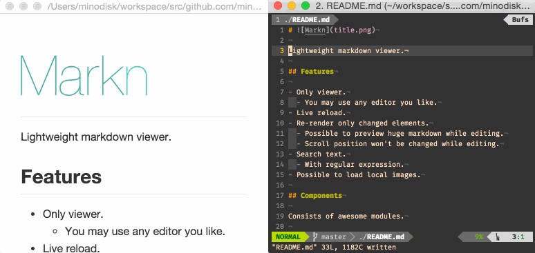

# 

Lightweight markdown viewer.

## Features

- Only viewer.
  - You may use any editor you like.
- Live reload.
  - Re-render only changed elements.
    - Possible to preview huge markdown while editing.
    - Scroll position won't be changed while editing.
- Search text.
  - With regular expression.
- Load local images.
- Open a link to markdown in this application.

## Screenshot

## Installation

1. Download zipped file from [latest release](https://github.com/minodisk/markn/releases/latest) and unzip it.
1. Double click Markn/Markn.app/Markn.exe.

## Components

Consists of awesome modules.

- [atom/electron](https://github.com/atom/electron)-based application.
- Render HTML with [facebook/react](https://github.com/facebook/react).
- Generate react elements from markdown AST with [mizchi/md2react](https://github.com/mizchi/md2react).
  - Generate markdown AST from markdown with [wooorm/mdast](https://github.com/wooorm/mdast).
- Watch file with [paulmillr/chokidar](https://github.com/paulmillr/chokidar).
- Style with [sindresorhus/github-markdown-css](https://github.com/sindresorhus/github-markdown-css).
  - Render some icons in [FortAwesome/Font-Awesome](https://github.com/FortAwesome/Font-Awesome).
  - Render emoji with [Ranks/emojione](https://github.com/Ranks/emojione).
  - Highlight code with [isagalaev/highlight.js](https://github.com/isagalaev/highlight.js)
